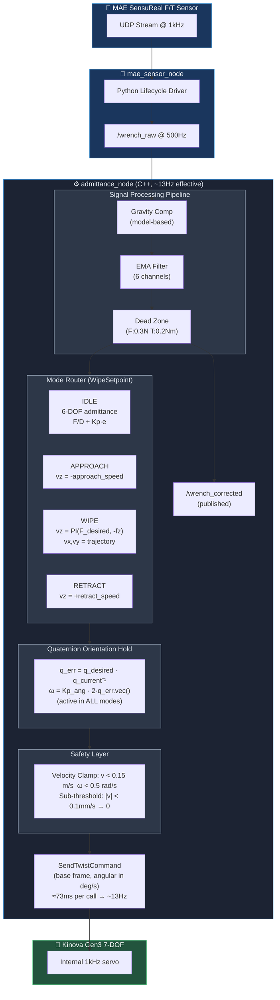
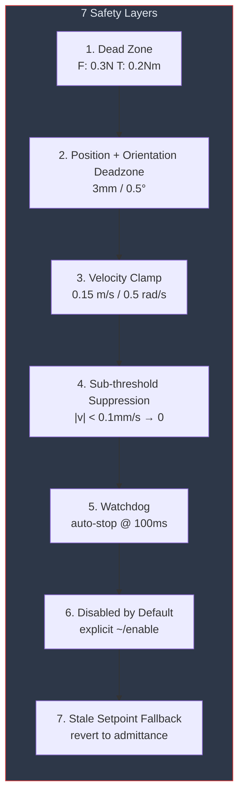

# Admittance Controller — Kinova Gen3 7-DOF

Full 6-DOF velocity-based admittance controller with PI force control for the
Kinova Gen3 arm with MAE SensuReal F/T sensor. Push or twist the end-effector
and it yields compliantly. Release it and it springs back to the original pose.
Switch to force-controlled wiping and the arm maintains constant contact force
while executing lateral trajectories.

Successfully demonstrated surface wiping with 5 N contact force at 0.02 m/s
wipe speed, June 2026. Steady-state force band: [-5.5, -4.5] N.

## What It Does

Two operating modes in one node:

**6-DOF Admittance (default):** Maps external forces and torques to compliant
Cartesian motion using a velocity-based admittance law:

```
Linear:   v = R · (F / D_linear)  + Kp · (pos_desired − pos_current)
Angular:  ω = R · (τ / D_angular) + Kp_angular · 2 · q_err.vec()
```

Orientation error uses quaternion representation — no gimbal lock, no
discontinuities. The short-path fix (`if q_err.w < 0 → negate`) prevents
\>180° corrections.

**Force-Controlled Wiping (via WipeSetpoint):** When the wipe_node publishes
setpoints, the admittance node executes them:
- APPROACH: velocity-commanded descent until contact detected
- WIPE: Z-axis force control (PI with anti-windup) + lateral X/Y from trajectory
- RETRACT: velocity-commanded lift-off
- Angular orientation hold remains active in all modes

## Architecture



## Sign Convention (Hardware-Verified)

| Action | wrench_corrected Fz | vz to correct |
|--------|---------------------|---------------|
| Press into surface (up) | **negative** | positive (ease off) |
| Pull away from surface (down) | **positive** | negative (push back) |
| No contact | ≈ 0 | 0 |

The PI controller receives `-fz` to flip the negative contact reading to
positive, matching the positive `force_desired_z`. This is the only sign
flip in the chain.

## Loop Rate Limitation

The control loop is configured at 100 Hz but achieves **~13 Hz** due to
Kortex high-level API latency:

```
 Section               Time        Bottleneck?
 ─────────────────────────────────────────────────────────────────
 wrench read           0.0 ms   ▏
 getCurrentPose        0.0 ms   ▏  (background thread cache)
 control math          0.2 ms   ▎  (gravity + EMA + admittance + quaternion)
 setCartesianVelocity  73.3 ms  ████████████████████████████████████████  ← gRPC bottleneck
 ─────────────────────────────────────────────────────────────────
 TOTAL                 73.5 ms  → ~13 Hz effective loop rate
```

| Section | Time | What |
|---------|------|------|
| wrench read | 0.0 ms | mutex-cached from 500 Hz subscriber |
| getCurrentPose | 0.0 ms | cached by background pose thread |
| control math | 0.2 ms | gravity comp + EMA + admittance + quaternion |
| setCartesianVelocity | **73 ms** | Kortex SendTwistCommand gRPC round-trip |

The `SendTwistCommand` call cannot be parallelized — it is the control output
and must be synchronous. Kinova documents 40 Hz max for high-level commands.
At 13 Hz with 20 mm/s wipe speed: 1.5 mm between updates — adequate for
surface wiping.

**Upgrade path:** Kortex low-level servoing API (1 kHz, joint-space commands,
requires user-side Jacobian computation and DLS IK).

## Hardware

| Component | Model | Role |
|-----------|-------|------|
| Arm | Kinova Gen3 7-DOF | Manipulator |
| F/T Sensor | MAE Robotics SensuReal | 6-axis wrench at 1kHz via UDP |
| End-Effector | Test handle (175g) | Validation payload (Robotiq 2F-85 next) |

## Build

```bash
# CRITICAL: Build kinova_wrapper for real hardware first
colcon build --packages-select kinova_wrapper \
  --cmake-args -DUSE_KORTEX_MOCK=OFF

# Build admittance controller
colcon build --packages-select admittance_controller

source install/setup.bash
```

## Run

```bash
# Launch both nodes
ros2 launch admittance_controller admittance.launch.py

# Transition MAE sensor to active
ros2 lifecycle set /mae_sensor_node configure
ros2 lifecycle set /mae_sensor_node activate

# Enable compliant motion
ros2 service call /admittance_node/enable std_srvs/srv/Trigger
```

## Services

| Service | Type | Description |
|---------|------|-------------|
| `~/tare` | `std_srvs/Trigger` | Re-zero sensor bias. Disables controller during tare. |
| `~/enable` | `std_srvs/Trigger` | Start compliant motion. Clears stale Kortex modes first. |
| `~/disable` | `std_srvs/Trigger` | Stop velocity commands. Watchdog auto-stops arm. |

## Topics

| Topic | Type | Dir | Hz | Description |
|-------|------|-----|-----|-------------|
| `/wrench_raw` | WrenchStamped | Sub | 500 | Raw F/T from MAE sensor (tool frame) |
| `~/wrench_corrected` | WrenchStamped | Pub | ~13 | After gravity comp + filter + dead zone |
| `/wipe_node/wipe_setpoint` | WipeSetpoint | Sub | 50 | Commands from wipe_node brain |

## Parameters

All dynamically reconfigurable via `ros2 param set`.

| Parameter | Default | Units | Description |
|-----------|---------|-------|-------------|
| `damping_x/y/z` | 150.0 | N·s/m | Linear damping. Higher = stiffer. |
| `damping_x/y/z_angular` | 5.0 | Nm·s/rad | Angular damping. |
| `position_gain` | 2.0 | 1/s | Spring-back speed. |
| `Kp_x/y/z_angular` | 0.5 | 1/s | Orientation regulation gain. |
| `dead_zone_force` | 0.3 | N | Force noise threshold. |
| `dead_zone_torque` | 0.2 | Nm | Torque noise threshold. |
| `max_velocity` | 0.15 | m/s | Linear velocity clamp. |
| `max_angular_velocity` | 0.5 | rad/s | Angular velocity clamp. |
| `filter_alpha` | 0.1 | — | EMA coefficient. Lower = smoother. |
| `gripper_mass` | 0.175 | kg | Payload mass (test handle). |
| `force_kp` | 0.001 | — | PI proportional gain (wipe Z force). |
| `force_ki` | 0.01 | — | PI integral gain (wipe Z force). |

## Safety



## Known Limitations

1. **13 Hz loop rate** — Kortex high-level API SendTwistCommand blocks for
   ~73ms per call. Adequate for slow contact tasks, insufficient for fast
   visual servoing. Fix: migrate to low-level servoing (1 kHz).

2. **Ki integral windup at reversals** — during wipe direction changes, the
   accumulated integral causes force spikes up to -7N (target -5N). Fix:
   add direct integral clamp or reduce Ki.

3. **Single tare pose** — gravity compensation degrades >30° from tare
   orientation. Re-tare via `~/tare` after repositioning.

4. **No joint-limit awareness** — admittance law operates in Cartesian space.
   Near joint limits, Kortex may reject velocity commands.

## Dependencies

- [kinova_wrapper](https://github.com/Sahilnarola-1007/kinova-wrapper)
- [mae_fts_sdk](https://github.com/MAE-Robotics) (system-wide pip install)
- ROS2 Jazzy, Eigen3, geometry_msgs, std_srvs, wipe_msgs

## Author

Sahil Narola — MEng, Carleton University
Advanced Biomechatronics and Locomotion Lab, Ottawa
